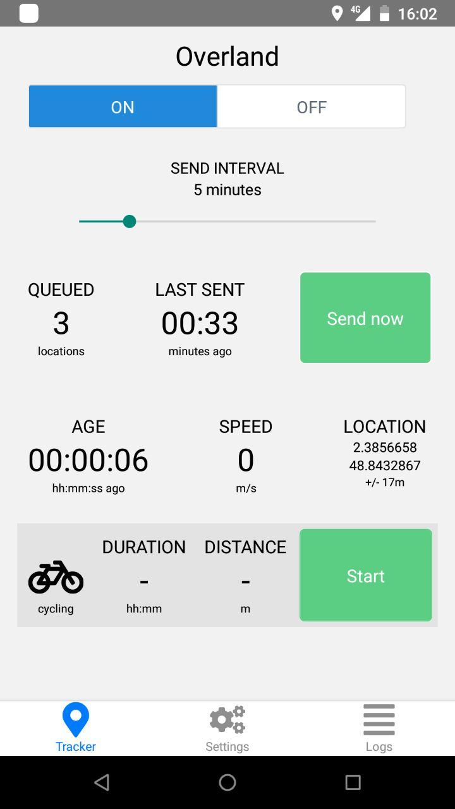
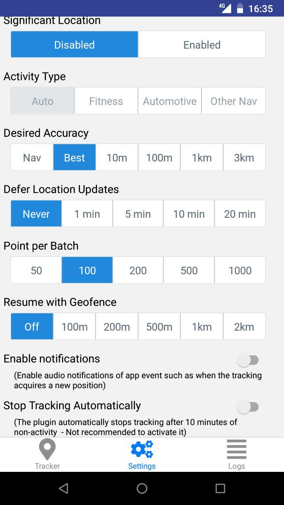
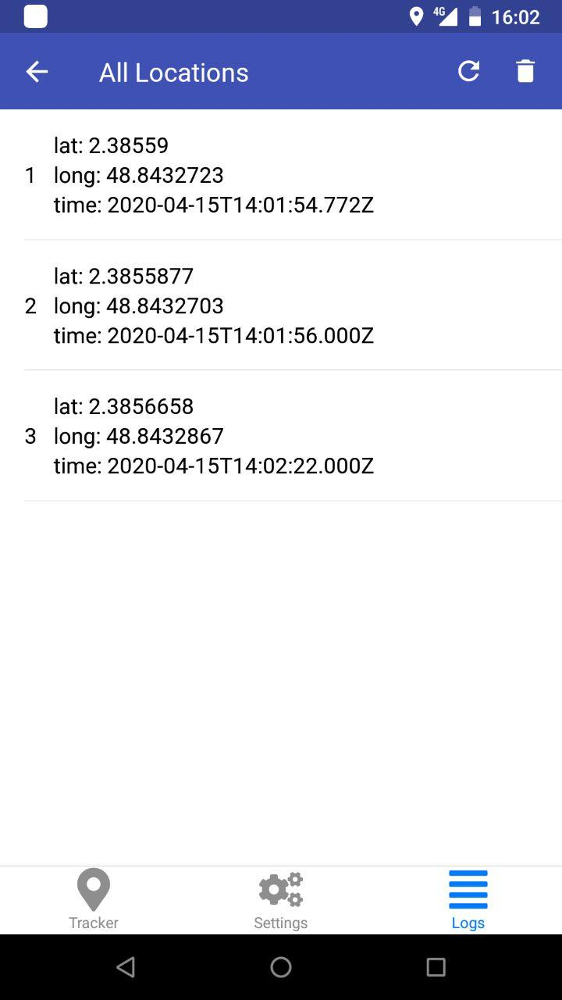

# Overland GPS Tracker for Android

GPS logger for Android devices in React Native. You can **[download this app from the Google Play Store](https://play.google.com/store/apps/details?id=com.openhumans.app.overland)**. 

Overland will send the data to a server of your choice. We offer a simple way to do this: You can use [https://overland.openhumans.org/](https://overland.openhumans.org/) to set up an endpoint that you can send the data to and collect it right from *Overland*. The data is privately and securely stored in *Open Humans*.

This app is based on the app Overland for iOS developped by Aaron Parecki https://github.com/aaronpk/Overland-iOS

It is an experiment at gathering data from an Android device to test the Core Location API of Android and its various settings.

 The app tracks:

* GPS location
* Motion State (walking, running, driving, cycling, stationary)
* Battery level
* Wifi access point (only name)

The app gathers data with no network connection and stores locally on the device. The data is sent to the server in a batch at an interval set by the user.

There are many settings available in the settings tab which allow you to adjust properties of the Core Location API.

## Documentation

React Native does not allow you to launch an application in the background (acquisition and fetch data), we use the react-native-background-location API to reach the Core Location API of Android. https://transistorsoft.github.io/react-native-background-geolocation/.

### Tracker Screen



The Tracker screen is where you control whether the app is active, and shows you some basic stats of what the app is doing. This is also where you start and stop trips.

* `On/Off` - This master switch enables and disables tracking. When it's set to off, the app stops requesting location updates, and won't record or send any more data.
* Main Slider - This slider controls the interval at which the app sends data to the server. Using the network connection is a huge source of battery drain, so you can save battery by sending infrequently to the server. The slider's range is from 1 second to 30 minutes, and the rightmost option is "off" which disables sending. This is useful when you know you don't have a network connection such as during flights. Data is queued up and will be sent once you enable sending later.
* `Queued` - This number indicates how many location points are stored in the application's internal database ready to be sent.
* `Last Sent` - Indicates how long ago the last batch was successfully sent to the server.
* `Send Now` - Tapping this button will send one batch to the server immediately.
* `Age` - The age of the last location point that was reported by the OS. You can use this to get a sense of how much data you are recording.
* `Speed` - The speed in mph of the last location update received.
* `Location` - Shows the latitude/longitude, accuracy, and altitude of the last location update received.
* `Icon` - This icon indicates the mode of transport that will be written for the trip record.
* `Duration` - When a trip is active, indicates how long the trip has been going for.
* `Distance` - When a trip is active, indicates how far has been traveled in this trip.
* `Start/Stop` - Starts and stops a trip record. After stopping a trip, the trip record is written to the database and sent to the server along with the location points.

### Settings

    


The Settings screen allows you to set the parameters of the iOS CoreLocation API, which gives you fine-grained control over how the tracker behaves.

These controls all set various properties of the LocationManager object. It is worth reading the [Android documentation](https://developer.android.com/reference/kotlin/android/location/LocationManager?hl=en) for more details, but a summary of them is below.

* `Receiver Endpoint` - Tap this line to set the endpoint that the app will send data to. You can also configure a device ID which will be included in each record, and an access token which will be sent in the HTTP Authorization header.
* `Significant Location`
  * Setting to "enabled" will register for [significant location changes](https://developer.apple.com/reference/corelocation/cllocationmanager/1423531-startmonitoringsignificantlocati) along with the continuous updates requested. Significant change events are triggered for example when you move to a new cell tower or when your nearby visible wifi access points change. It's not an exact science, and may be triggered more or less often than you expect.
  * Setting to "significant only" will *only* register significant changes, and will not request continuous updates. This will use very little battery for tracking, but will not result in detailed lines showing your tracks.
* `Activity Type` - this setting is not available on Android
* `Desired Accuracy` - Sets the [desiredAccuracy](https://developer.android.com/reference#PRIORITY_BALANCED_POWER_ACCURACY) property of the location manager. This is only a request for the general level of accuracy, not a guarantee. Setting to "Best" will use the most battery but will get highest accuracy location updates. Setting to "3km" will save the most battery but will result in infrequent location updates.
* `Defers Location Updates` - The maximum wait time in milliseconds for location updates to be delivered to your callback, when they will all be delivered in a batch. It is worth reading Android's documentation of [deferred Location updates](https://developer.apple.com/documentation/corelocation/cllocationmanager/1620547-allowdeferredlocationupdates) for more information. This can have an effect on improving battery life. Defaults to 0 (no defer)
* `Points per Batch` - Controls the number of location updates that will be sent with each HTTP request. Setting this to 50 will mean more requests to the server are required to flush the queue, but each request will be smaller. Setting this to 1000 means you'll be able to flush the queue with fewer requests, but each request will be much larger. Each location point can be around 600 bytes when serialized as JSON, so sending 1000 points in a request will mean the request body may be around 600kb. Lower batch sizes are likely better for flaky network connections, and larger batch sizes are good when on a reliable connection. Note that this does not affect the frequency at which data is sent to the server.
* `Pause Updates Automatically` - Enabling this will use the iOS API for automatically pausing location updates. When disabled, it will prevent the OS from pausing location updates. Pausing location updates automatically is a great way to save battery when you are not moving for extended periods of time, although it does not always pick up tracking again immediately when you start moving. In some initial testing, the automatic pause tends to trigger about 10 minutes after you've stopped moving.
* `Resume with Geofence` - This is not an core API, but is an attempt at overcoming the automatic pausing limitations. Setting a radius here will register an "exit" geofence whenever location updates are paused at that location. This will attempt to get the app woken up when the user leaves the area again, and when triggered, will resume tracking with the previous settings.
* `Enable notifications` - Toggle whether the app should send notifications about events such as when tracking has been automatically stopped and started.

### Logs



The list of stored location points.  

#### Configuration by Custom URL

(-->overland)


#### High Resolution Tracking

To get high resolution data, you should set the following:

* Resume with Geofence: Off
* Significant Location: Disabled
* Desired Accuracy: Best
* Defers Location Updates: Never

While moving, you will receive up to one point per second. When you're not moving, such as when you're at your desk, etc, there may be several minutes between location updates received. This will use a lot of battery, but will result in data that can be used to generate a picture similar to this level of detail.


#### Battery Saving / Low Resolution

To use very little battery, you can still get enough location info to know what neighborhood you're in, and likely also when you leave and return home.

* Resume with Geofence: 500m
* Significant Location: Enabled
* Desired Accuracy: 100m
* Defers Location Updates: 5min

This will use much less battery than high resolution, while still gathering enough data you can use to roughly geotag posts or know what neighborhood you're in. For even more battery savings, you can set Significant Location Only, which will drastically reduce the amount of data you log but will use almost no battery.

## API

The app will post the location data to the configured endpoint. The POST request will be an array of GeoJSON objects inside a property called "locations". The batch size is 200 but can be set [in the configuration](https://github.com/aaronpk/Overland-iOS/blob/master/GPSLogger/GLManager.h#L40). This request may look like the following:

```
POST /api HTTP/1.1
Authorization: Bearer xxxxxx
Content-Type: application/json

{
  "locations": [
    {
      "type": "Feature",
      "geometry": {
        "type": "Point",
        "coordinates": [
          -122.030581,
          37.331800
        ]
      },
      "properties": {
        "timestamp": "2015-10-01T08:00:00-0700",
        "altitude": 0,
        "speed": 4,
        "horizontal_accuracy": 30,
        "vertical_accuracy": -1,
        "motion": ["driving","stationary"],
        "pauses": false,
        "activity": "other_navigation",
        "desired_accuracy": 100,
        "deferred": 1000,
        "significant_change": "disabled",
        "locations_in_payload": 1,
        "battery_state": "charging",
        "battery_level": 0.89,
        "device_id": "",
        "wifi": ""
      }
    }
  ],
  "current": { ... }, (optional)
  "trip": { ... } (optional)
}
```

The properties on the `location` objects are as follows:

* `timestamp` - the ISO8601 timestamp of the `CLLocation` object recorded
* `altitude` - the altitude of the location in meters
* `speed` - meters per second
* `horizontal_accuracy` - accuracy of the position in meters
* `vertical_accuracy` - accuracy of the altitude in meters
* `motion` - an array of motion states detected by the motion coprocessor. Possible values are: `driving`, `walking`, `running`, `cycling`, `stationary`. A common combination is `driving` and `stationary` when the phone is resting on the dashboard of a moving car.
* `battery_state` - `unknown`, `charging`, `full`, `unplugged`
* `battery_level` - a value from 0 to 1 indicating the percent battery remaining.
* `wifi` - If the device is connected to a wifi hotspot, the name of the SSID will be included
* `device_id` - The device ID configured in the settings, or an empty string

The following properties are included only if the "include tracking stats" option is selected:

* `pauses` - boolean, whether the "pause updates automatically" preference is checked
* `activity` - a string denoting the type of activity as indicated by the setting. Possible values are `automotive_navigation`, `fitness`, `other_navigation` and `other`. This can be set on the settings screen.
* `desired_accuracy` - the requested accuracy in meters as configured on the settings screen.
* `deferred` - the distance in meters to defer location updates, configured on the settings screen.
* `significant_change` - a string indicating the significant change mode, `disabled`, `enabled` or `exclusive`.
* `locations_in_payload` - the number of locations that were sent in the batch along with this location


### Response

Your server must reply with a JSON response containing:

```json
{
  "result": "ok"
}
```

### Current Location

To be done

### Current Trip

If a trip is active, an object called `trip` will be included in the request as well, with information about the current trip. This object will contain the following properties:

* `distance` - current trip distance in meters as calculated by the device
* `mode` - the trip mode as a string
* `current_location` - a `location` record that represents the most recent location of the device
* `start_location` - a `location` record that represents the location at the start of the trip
* `start` - an ISO8601 timestamp representing the time the trip was started. this may be slightly different from the timestamp in the start location.

## Installation

Install packages  react-native , expo and our packages

```
yarn add react-native

npm install -g expo-cli

npm install
```

## First step : debug version

Connect your smartphone via USB,

* First Method (automatically)
In a first terminal

`react-native start`

In a first terminal

`npx react-native run-android`

* Second Method (manually)

`cd android && ENVFILE=.env ./gradlew assembleDebug`

And load the apk in your device

The React Native Background Location API from Transistorsoft is free in Debug.

## Next Step : release version

To build a release version

* Duplicate `.env` to a new file `.env.production`
* Move in android/app `cd android/app`
* Generate your keystore with your password : `keytool -genkey -v -keystore my-key.keystore -alias my-key-alias -keyalg RSA -keysize 2048 -validity 10000`
* update in `.env.production` MYAPP_RELEASE_STORE_PASSWORD and MYAPP_RELEASE_KEY_PASSWORD
* MYAPP_RELEASE_API_KEY is the API key that https://www.transistorsoft.com/ provides to use their API after buying a licence
* Go back in the project root
* Build your release version `cd android && ENVFILE=.env.production ./gradlew assembleRelease`


## Licence

Contributions from 2020 onward are copyright by Nicolas Eberlé

Based on Overland iOs UI developped by Aaron Parecki

Licensed under the Apache License, Version 2.0 (the "License");
you may not use this file except in compliance with the License.
You may obtain a copy of the License at

http://www.apache.org/licenses/LICENSE-2.0

Unless required by applicable law or agreed to in writing, software
distributed under the License is distributed on an "AS IS" BASIS,
WITHOUT WARRANTIES OR CONDITIONS OF ANY KIND, either express or implied.
See the License for the specific language governing permissions and
limitations under the License.
